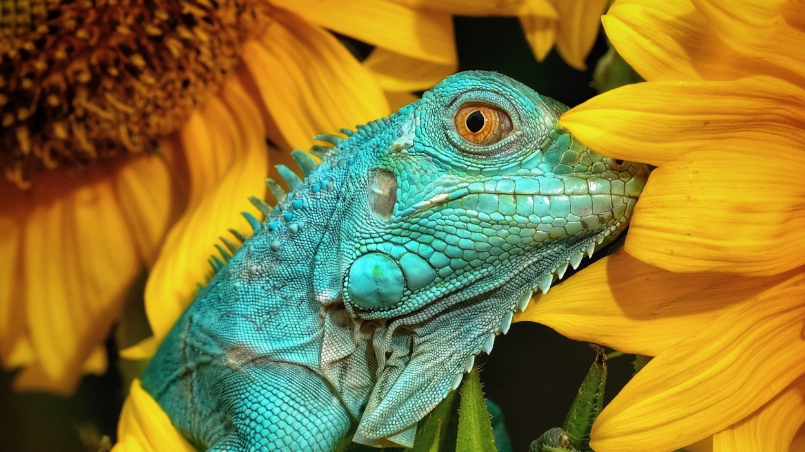
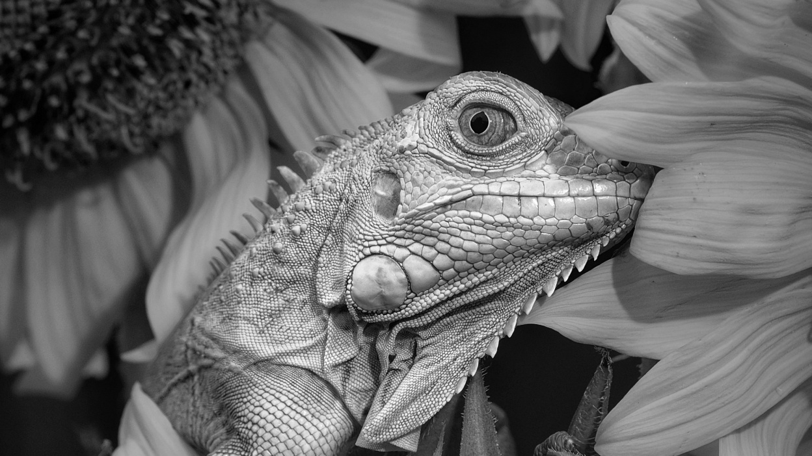
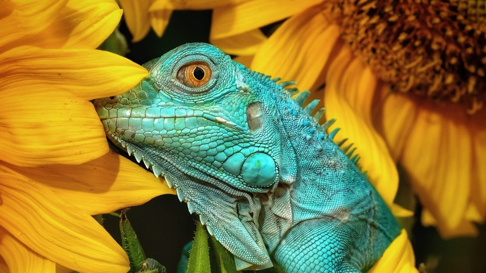

# Cuda Image Filter

This project is a CUDA-based image processing application that allows users to convert images to grayscale and mirror them horizontally. It utilizes the OpenCV library for image processing and the Boost library for command-line argument parsing.

## Algorithm
1.Parse command-line arguments for input file, output file, and transformation options (mirror/gray).
2.Load input image using OpenCV.
3.Allocate memory on GPU for input and output images.
4.Copy input image from host to device (GPU).
5.Launch CUDA kernel:
6.If --mirror option is set, apply mirror transformation.
7.If --gray option is set, convert the image to grayscale.
8.Synchronize GPU to ensure the kernel finishes processing.
9.Copy output image from device back to host.
10.Save output image to file using OpenCV.
11.Free GPU memory.
12.Exit the program.

## Outputs

Original image:

  

Filtered image (Grayscale): 

  

Filtered image (Mirror): 

  

